# YouTube Mobile Frontend Clone

A mobile-first, YouTube frontend clone featuring 20+ screens, 30+ reusable components, a custom icon system, and app-like navigation with zero-dependency bottom sheets and swipeable tabs.

## Screenshots


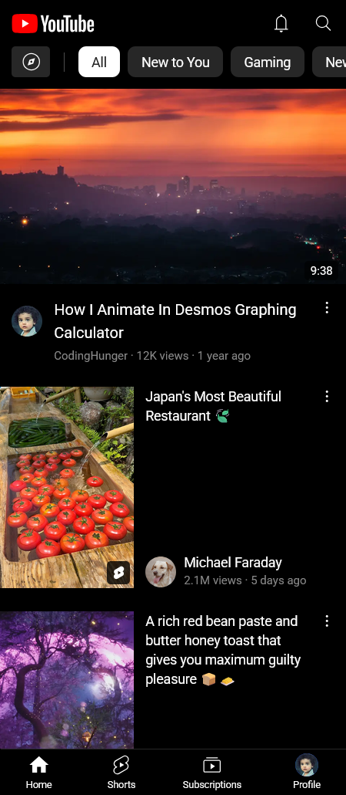 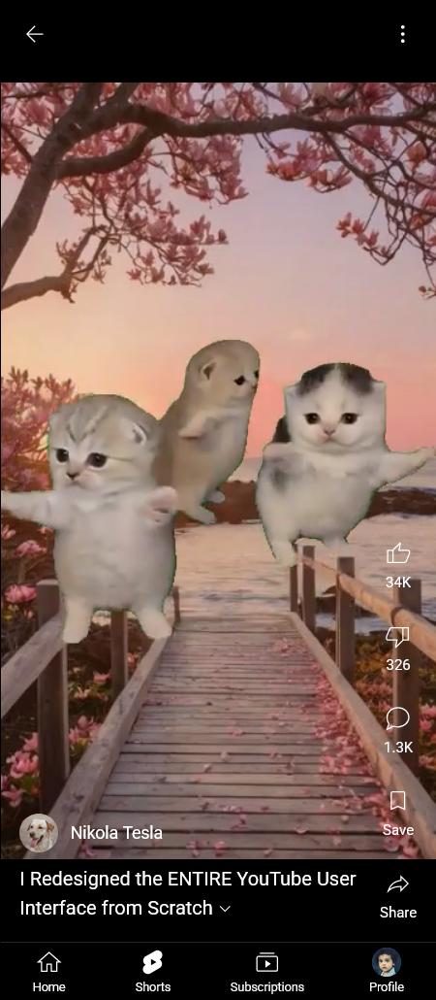 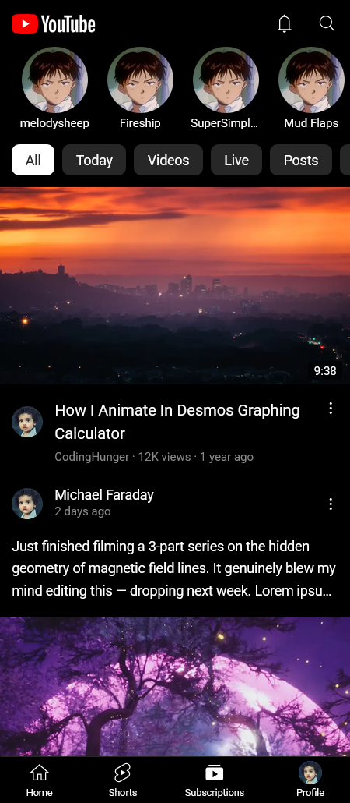 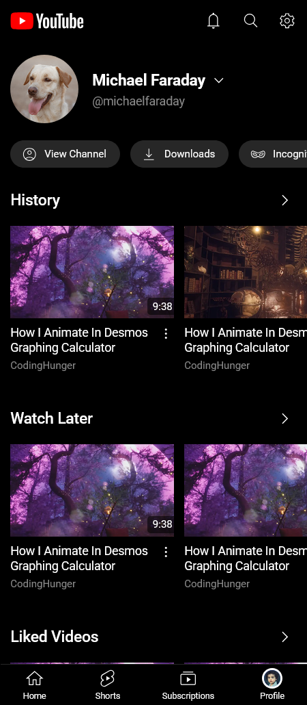 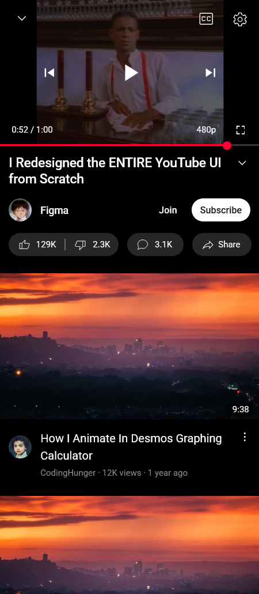 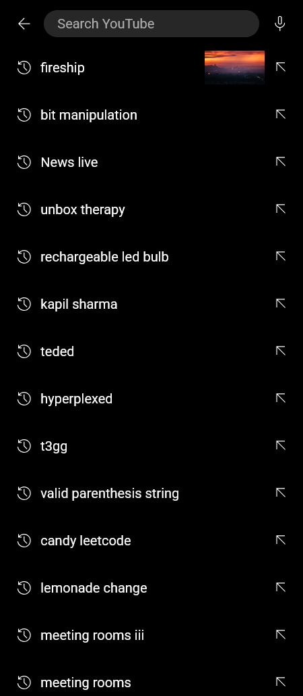  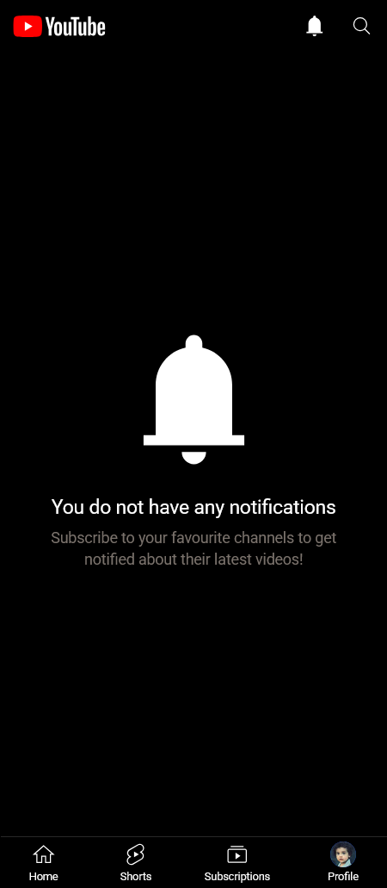 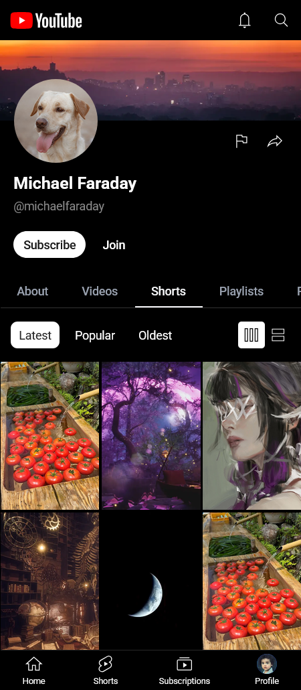 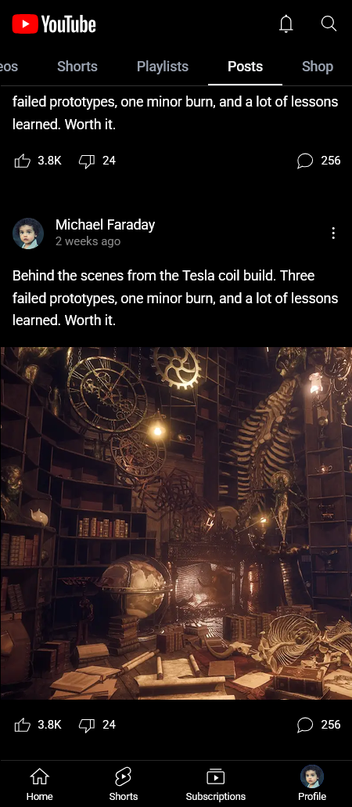  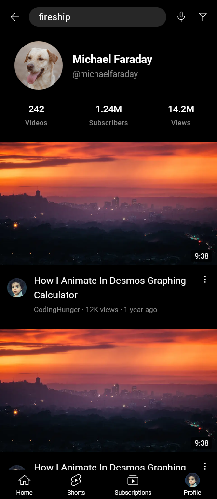  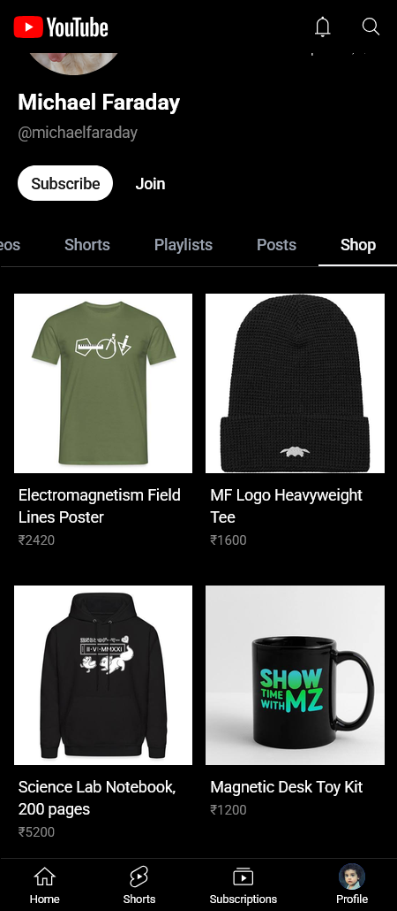


## Tech Stack

[](https://react.dev/)
[](https://www.typescriptlang.org/)
[](https://tailwindcss.com/)
[](https://reactrouter.com/)
[](https://vitejs.dev/)
[](https://vercel.com/)


* **Framework:** [React](https://react.dev/)
* **Language:** [TypeScript](https://www.typescriptlang.org/)
* **Styling:** [Tailwind CSS](https://tailwindcss.com/)
* **Routing:** [React Router](https://reactrouter.com/)
* **Build tool:** [Vite](https://vitejs.dev/)
* **Platform:** [Vercel](https://vercel.com/)


## Installation


1. Clone the repository:
    
    ```
    git clone https://github.com/LadyBeGood/youtube.git
    ```
2. Install dependencies:

    ```
    npm install
    ```

3. Run the development server:

    ```
    npm run host
    ```


## Roadmap

- [x] Basic layout
- [x] Layout
- [x] Home page
- [x] Subscription page
- [x] Notifications page
- [x] Search page
- [x] Profile page
- [x] Results page
- [x] Bottom only layout
- [x] Channel 
    - [x] About
    - [x] Videos
    - [x] Shorts
    - [x] Playlists
    - [ ] Courses
    - [ ] Podcasts
    - [ ] Live
    - [x] Shop
- [x] Video page
    - [x] Comment section
    - [x] Description
    - [x] Video details
    - [x] Video player
        - [ ] Fullscreen
        - [x] Settings
- [x] Explore menu
- [x] Settings page
- [ ] Playlist page
- [x] Bottom sheet
- [x] Shorts page
    - [x] Shorts player
        - [ ] Comment section
        - [ ] Settings
- [x] Scrollable tabs
- [x] Custom icons
- [x] Cards
    - [x] Video card
    - [x] Small video card
    - [x] Thin video card
    - [x] Post card
    - [ ] Playlist card (issues with margin collapse)
    - [x] Small playlist card
    - [x] Thin playlist card
    - [x] Shorts card
    - [x] Thin shorts card
    - [x] Channel card
    - [x] Podcast card
    - [x] Shop card
    - [x] Comment card
- [x] Accessibility
    - [x] aria
    - [ ] Keyboard navigation
    - [ ] Accessible video players
- [ ] Responsiveness (Put on hold for now)
    - [x] Home page
    - [x] Search bar/page
    - [ ] Shorts page
    - [ ] Results
    - [ ] Profile
    - [x] Subscription page
- [ ] Mock data
    - [ ] Videos
    - [ ] Users (with profile pictures)
    - [ ] Comments
    - [ ] Posts
    - [ ] Playlists
    - [ ] Channels


## License
© 2026 LadyBeGood. All Rights Reserved.